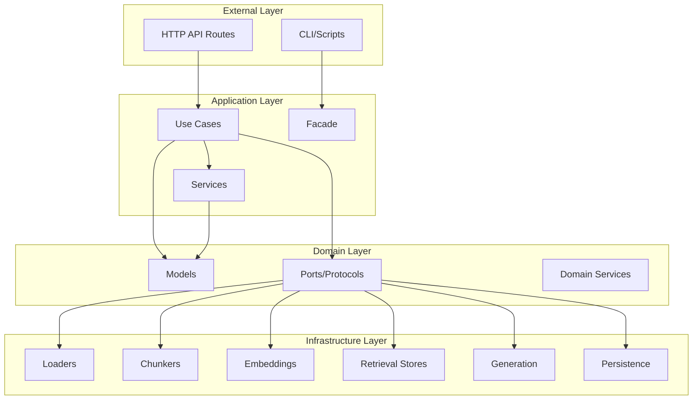
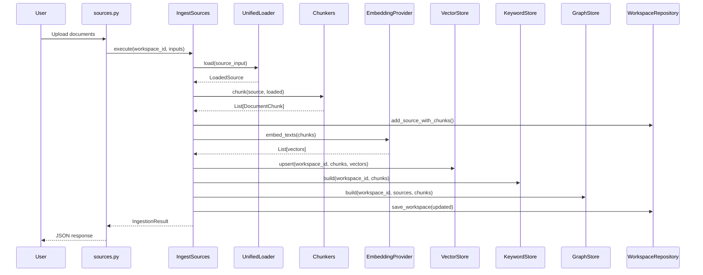
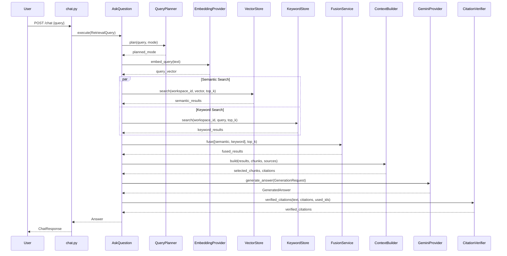
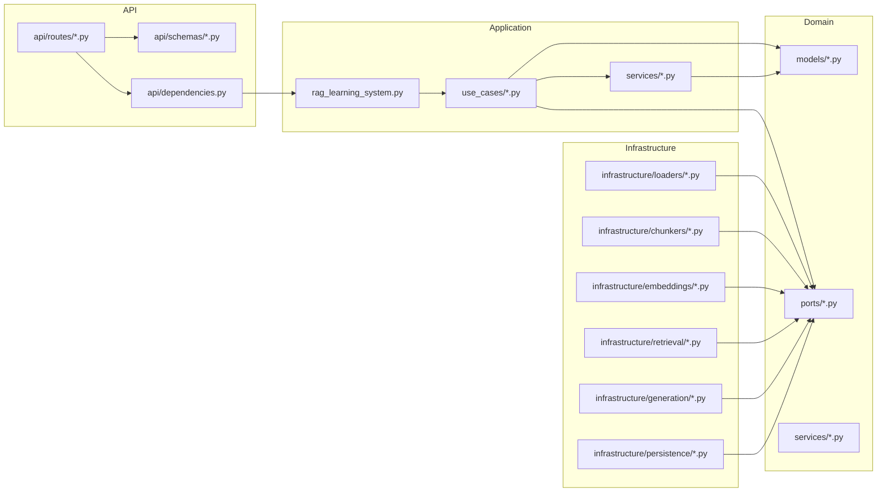

# 🧠 CODEBASE INTELLIGENCE REPORT

## Document Information
- **Generated**: 2026-04-28
- **Project**: MultiRAG Learning System
- **Location**: `C:\Users\Hp\Ai Learning system`
- **Primary Language**: Python
- **Framework**: FastAPI
- **Architecture**: Hexagonal (Ports & Adapters) / Clean Architecture

---

## 1. Project Overview

### Purpose
The MultiRAG Learning System is a **Retrieval-Augmented Generation (RAG) learning platform** that enables users to:
- Ingest multiple document types (PDF, Markdown, Text, URLs, Code files)
- Create isolated workspaces for organizing knowledge
- Ask questions grounded in uploaded sources with traceable citations
- Explore knowledge through semantic search, keyword search, and graph visualization
- Generate source guides and summaries automatically

### Core Functionality
1. **Document Ingestion**: Loads and processes documents from various sources
2. **Intelligent Chunking**: Splits documents into traceable chunks with location metadata
3. **Multi-Modal Retrieval**: Combines semantic (vector), keyword (BM25), and graph-based search
4. **Grounded Generation**: Uses Google's Gemini API with deterministic fallback
5. **Knowledge Graph**: Builds concept graphs connecting sources, chunks, and extracted concepts
6. **Workspace Management**: Isolated knowledge containers with versioning

### System Type
**Hybrid API Backend** - FastAPI-based REST API with:
- Async/await support throughout
- Local-first file-based persistence
- Configurable embedding and generation providers
- Multi-layered caching strategy

---

## 2. High-Level Architecture

### Architecture Style: **Hexagonal (Ports & Adapters) / Clean Architecture**

The codebase strictly follows Hexagonal Architecture principles with clear separation:



### Architecture Components

| Layer | Responsibility | Key Files |
|-------|---------------|-----------|
| **Domain** | Core business logic, model definitions, contracts | `app/domain/` |
| **Application** | Orchestration, use cases, workflows | `app/application/` |
| **Infrastructure** | External adapters, concrete implementations | `app/infrastructure/` |
| **API** | HTTP interface, request/response handling | `app/api/` |

### Data Flow
```
User Request → API Routes → Use Cases → Domain Services → Infrastructure Adapters
                                                    ↓
User Response ← API Response ← Application Response ← Data Storage
```

---

## 3. Folder & Module Breakdown

### 📁 Root Structure
```
C:\Users\Hp\Ai Learning system/
├── backend/               # Main Python backend
├── docs/                  # Architecture documentation
├── data/                  # Runtime data storage
├── scripts/               # Utility scripts
├── eval/                  # Evaluation resources
└── MultRAG System/        # Additional system folder
```

### 📁 backend/

#### 📁 app/ - Main Application Package

##### 📁 domain/ - Core Business Logic

###### 📁 models/ - Domain Entities
| File | Responsibility | Key Classes |
|------|---------------|-------------|
| `base.py` | Shared domain primitives | `utc_now()`, `new_id()`, `DomainEventMetadata` |
| `workspace.py` | Workspace entity | `Workspace` |
| `source_document.py` | Source document contracts | `SourceType`, `SourceInput`, `LoadedSource`, `SourceDocument` |
| `document_chunk.py` | Chunk entities | `ChunkLocation`, `DocumentChunk` |
| `answer.py` | Answer contracts | `Citation`, `SourceGuide`, `Answer` |
| `retrieval.py` | Retrieval contracts | `RetrievalMode`, `RetrievalQuery`, `RetrievalResult`, `RetrievalDiagnostics` |
| `graph.py` | Graph DTOs | `GraphNodeType`, `GraphNode`, `GraphEdge`, `GraphSnapshot` |
| `exceptions.py` | Domain exceptions | `MultiRagError`, `SourceLoadError`, etc. |

###### 📁 ports/ - Interface Contracts (Protocols)
| File | Responsibility | Key Protocol |
|------|---------------|--------------|
| `workspace_repository.py` | Workspace persistence | `WorkspaceRepositoryPort` |
| `vector_store.py` | Vector search | `VectorStorePort` |
| `keyword_store.py` | Keyword search | `KeywordStorePort` |
| `graph_store.py` | Graph storage | `GraphStorePort` |
| `embedding_provider.py` | Embeddings | `EmbeddingProviderPort` |
| `generation_provider.py` | LLM generation | `GenerationProviderPort` |
| `chunker.py` | Document chunking | `ChunkerPort` |
| `source_loader.py` | Source loading | `SourceLoaderPort` |
| `cache_store.py` | Caching | `CacheStorePort` |

###### 📁 services/ - Pure Domain Services
| File | Responsibility | Key Class |
|------|---------------|-----------|
| `retrieval_fusion.py` | Result fusion | `ReciprocalRankFusionService` |
| `chunk_hashing.py` | Hash utilities | `sha256_text()`, `stable_json_hash()`, `chunk_hash()` |

##### 📁 application/ - Use Cases & Orchestration

###### 📁 use_cases/
| File | Responsibility | Key Class |
|------|---------------|-----------|
| `create_workspace.py` | Workspace creation | `CreateWorkspace` |
| `ingest_sources.py` | Source ingestion | `IngestSources`, `IngestionResult` |
| `ask_question.py` | Q&A with RAG | `AskQuestion` |
| `get_graph.py` | Graph retrieval | `GetGraph` |
| `generate_source_guide.py` | Guide generation | `GenerateSourceGuide` |

###### 📁 services/
| File | Responsibility | Key Class |
|------|---------------|-----------|
| `citation_verifier.py` | Citation validation | `CitationVerifier` |
| `context_builder.py` | Context assembly | `ContextBuilder` |
| `query_planner.py` | Mode selection | `QueryPlanner` |

###### `rag_learning_system.py`
**Central Application Facade** - `RagLearningSystem` class
- Factory method `from_settings()` wires all dependencies
- Public API for external consumers
- Coordinates all use cases

##### 📁 infrastructure/ - Concrete Adapters

###### 📁 config/
| File | Responsibility | Key Class |
|------|---------------|-----------|
| `settings.py` | Configuration | `Settings` |
| `logging.py` | Logging setup | `configure_logging()`, `timed_operation` |

###### 📁 loaders/
| File | Responsibility | Key Class |
|------|---------------|-----------|
| `base_loader.py` | Abstract loader | `BaseLoader` |
| `unified_loader.py` | Router | `UnifiedLoader` |
| `pdf_loader.py` | PDF loading | `PdfLoader` |
| `markdown_loader.py` | Markdown loading | `MarkdownLoader` |
| `text_loader.py` | Text loading | `TextLoader` |
| `code_loader.py` | Code loading | `CodeLoader` |
| `web_loader.py` | URL fetching | `WebLoader`, `_TextExtractor` |

###### 📁 chunkers/
| File | Responsibility | Key Class |
|------|---------------|-----------|
| `recursive_text_chunker.py` | Text chunking | `RecursiveTextChunker` |
| `markdown_chunker.py` | Markdown-aware | `MarkdownChunker` |
| `code_chunker.py` | Code chunking | `CodeChunker` |

###### 📁 embeddings/
| File | Responsibility | Key Class |
|------|---------------|-----------|
| `sentence_transformer_embeddings.py` | Embeddings | `HashingEmbeddingProvider`, `SentenceTransformerEmbeddingProvider` |
| `embedding_cache.py` | Cache decorator | `CachedEmbeddingProvider` |

###### 📁 retrieval/
| File | Responsibility | Key Class |
|------|---------------|-----------|
| `faiss_vector_store.py` | Vector store | `FaissVectorStore` |
| `qdrant_vector_store.py` | Placeholder | `QdrantVectorStore` |
| `bm25_store.py` | Keyword store | `Bm25Store` |
| `graph_networkx_store.py` | Graph store | `GraphNetworkxStore` |

###### 📁 generation/
| File | Responsibility | Key Class |
|------|---------------|-----------|
| `gemini_provider.py` | LLM adapter | `GeminiProvider` |
| `prompt_templates.py` | Prompt versioning | `ANSWER_PROMPT_VERSION`, `SOURCE_GUIDE_PROMPT_VERSION` |

###### 📁 persistence/
| File | Responsibility | Key Class |
|------|---------------|-----------|
| `file_workspace_repository.py` | File-based repo | `FileWorkspaceRepository` |
| `sqlite_metadata_store.py` | Placeholder | `SqliteMetadataStore` |
| `disk_cache_store.py` | Disk cache | `DiskCacheStore` |

##### 📁 api/ - HTTP Interface

###### 📁 routes/
| File | Responsibility | Endpoints |
|------|---------------|-----------|
| `health.py` | Health check | `GET /health` |
| `workspaces.py` | Workspace CRUD | `POST /workspaces`, `GET /workspaces` |
| `sources.py` | Source ingestion | `POST /sources/upload`, `POST /sources/url`, etc. |
| `chat.py` | Q&A | `POST /chat` |
| `graph.py` | Graph data | `GET /graph` |
| `source_guides.py` | Guides | `GET /source-guide` |
| `system.py` | Admin | `POST /reset` |

###### 📁 schemas/
| File | Responsibility | Key Classes |
|------|---------------|-------------|
| `workspace_schemas.py` | Workspace DTOs | `WorkspaceCreateRequest`, `WorkspaceResponse` |
| `source_schemas.py` | Source DTOs | `UrlIngestionRequest`, `IngestionResponse` |
| `chat_schemas.py` | Chat DTOs | `ChatRequest`, `ChatResponse` |
| `graph_schemas.py` | Graph DTOs | `GraphResponse` |
| `source_guide_schemas.py` | Guide DTOs | `SourceGuideResponse` |
| `error_schemas.py` | Error DTO | `ErrorResponse` |

###### `dependencies.py`
- `get_settings()` - LRU-cached settings
- `get_rag_system()` - Application facade singleton

##### 📁 tests/
| File | Responsibility |
|------|---------------|
| `unit/test_chunking.py` | Markdown chunker tests |
| `unit/test_retrieval_fusion.py` | RRF fusion tests |
| `integration/test_facade_flow.py` | End-to-end facade tests |
| `fixtures/demo_notes.md` | Test fixture |

### 📁 scripts/
| File | Responsibility |
|------|---------------|
| `seed_demo_workspace.py` | Demo workspace seeding script |

---

## 4. Class-Level Analysis

### 🧩 Class: Workspace
- **File**: `app/domain/models/workspace.py`
- **Responsibility**: Represents a knowledge workspace/container
- **Design Pattern**: Domain Model (rich domain object)
- **Key Methods**:

#### Method: `create(cls, name: str) -> Workspace`
- **Purpose**: Factory method to create new workspace
- **Inputs**: `name` - workspace name string
- **Outputs**: New `Workspace` instance with generated ID and timestamps
- **Called**: When creating workspaces via API
- **Logic**: Generates ID with prefix, sets timestamps, returns instance

#### Method: `mark_index_changed(self, source_count: int, chunk_count: int) -> None`
- **Purpose**: Updates index version and statistics
- **Called**: After ingestion completes
- **Logic**: Increments version, updates counts, refreshes timestamp

### 🧩 Class: RagLearningSystem
- **File**: `app/application/rag_learning_system.py`
- **Responsibility**: Public facade coordinating all workflows
- **Design Pattern**: Facade, Dependency Injection
- **Key Methods**:

#### Method: `from_settings(cls, settings: Settings) -> RagLearningSystem`
- **Purpose**: Factory wiring all dependencies
- **Logic**: 
  1. Creates repositories
  2. Configures loaders (PDF, Markdown, Text, URL, Code)
  3. Sets up chunkers
  4. Configures embedding provider (with caching)
  5. Initializes retrieval stores (FAISS, BM25, Graph)
  6. Creates generation provider
  7. Wires all use cases
  8. Returns configured facade

### 🧩 Class: IngestSources
- **File**: `app/application/use_cases/ingest_sources.py`
- **Responsibility**: Orchestrates document ingestion pipeline
- **Design Pattern**: Use Case / Transaction Script

#### Method: `execute(self, workspace_id: str, inputs: list[SourceInput]) -> IngestionResult`
- **Purpose**: Ingests documents into workspace
- **Logic**:
  1. Creates semaphore for concurrency control (max 3 concurrent)
  2. Processes each source async with `asyncio.gather`
  3. Loads documents, deduplicates by hash
  4. Chunks documents based on source type
  5. Persists sources and chunks
  6. Generates embeddings for chunks
  7. Builds vector, keyword, and graph indexes
  8. Updates workspace statistics
  9. Returns `IngestionResult` with stats and warnings

### 🧩 Class: AskQuestion
- **File**: `app/application/use_cases/ask_question.py`
- **Responsibility**: RAG question answering
- **Design Pattern**: Use Case

#### Method: `execute(self, query: RetrievalQuery) -> Answer`
- **Purpose**: Answers user questions using RAG
- **Logic**:
  1. Plans retrieval mode (or uses requested)
  2. Checks answer cache
  3. Performs multi-modal retrieval (semantic, keyword, graph)
  4. Fuses results using RRF
  5. Builds context from retrieved chunks
  6. Generates answer with citations
  7. Verifies citations
  8. Caches and returns answer

### 🧩 Class: FileWorkspaceRepository
- **File**: `app/infrastructure/persistence/file_workspace_repository.py`
- **Responsibility**: File-based workspace persistence
- **Design Pattern**: Repository

#### Key Methods:
- `save_workspace()` - Persists workspace to JSON
- `get_workspace()` - Loads workspace or raises `WorkspaceNotFoundError`
- `list_workspaces()` - Scans directories for manifests
- `add_source_with_chunks()` - Appends to JSONL files
- `list_sources()` - Reads sources.jsonl
- `list_chunks()` - Reads chunks.jsonl, optionally filters by source
- `find_source_by_hash()` - Deduplication helper

### 🧩 Class: FaissVectorStore
- **File**: `app/infrastructure/retrieval/faiss_vector_store.py`
- **Responsibility**: Vector similarity search
- **Design Pattern**: Adapter, Strategy

#### Key Methods:
- `upsert()` - Adds/updates chunks with normalized vectors
- `search()` - Cosine similarity search using dot product
- `clear()` - Removes index file

### 🧩 Class: Bm25Store
- **File**: `app/infrastructure/retrieval/bm25_store.py`
- **Responsibility**: Keyword-based retrieval
- **Design Pattern**: Adapter

#### Key Methods:
- `build()` - Computes TF/IDF statistics from chunks
- `search()` - BM25 scoring with Okapi BM25 formula
- `_score()` - Calculates BM25 score per document

### 🧩 Class: GraphNetworkxStore
- **File**: `app/infrastructure/retrieval/graph_networkx_store.py`
- **Responsibility**: Graph storage and exploration
- **Design Pattern**: Adapter

#### Key Methods:
- `build()` - Creates nodes/edges from sources/chunks, extracts concepts
- `snapshot()` - Returns subgraph around focus node
- `search()` - Concept-based chunk retrieval
- `_concepts()` - Extracts key terms using regex
- `_neighborhood()` - BFS traversal for subgraph

### 🧩 Class: GeminiProvider
- **File**: `app/infrastructure/generation/gemini_provider.py`
- **Responsibility**: LLM generation with fallback
- **Design Pattern**: Adapter, Strategy

#### Key Methods:
- `generate_answer()` - Uses Gemini API or extractive fallback
- `generate_source_guide()` - Creates structured guide from chunks
- `_extractive_answer()` - Fallback using term matching
- `_best_sentence()` - Finds most relevant sentence

---

## 5. Function-Level Deep Dive

### 🔧 Function: `utc_now()`
- **Location**: `app/domain/models/base.py:12`
- **Purpose**: Returns timezone-aware UTC datetime
- **Return**: `datetime` with `timezone.utc`

### 🔧 Function: `new_id(prefix: str)`
- **Location**: `app/domain/models/base.py:16`
- **Purpose**: Generates unique IDs with prefix
- **Logic**: `f"{prefix}_{uuid4().hex[:12]}"`
- **Return**: String like `"workspace_a1b2c3d4e5f6"`

### 🔧 Function: `sha256_text(text: str)`
- **Location**: `app/domain/services/chunk_hashing.py:10`
- **Purpose**: Creates SHA256 hash of text
- **Logic**: `hashlib.sha256(text.encode("utf-8", errors="ignore")).hexdigest()`

### 🔧 Function: `stable_json_hash(value: Any)`
- **Location**: `app/domain/services/chunk_hashing.py:14`
- **Purpose**: Deterministic hash for any JSON-serializable value
- **Logic**: Sorts keys, compact format, then SHA256

### 🔧 Function: `chunk_hash(...)`
- **Location**: `app/domain/services/chunk_hashing.py:19`
- **Purpose**: Unique identifier for chunks
- **Inputs**: source_hash, text, ordinal, chunker_version
- **Logic**: Hashes dictionary of all inputs

### 🔧 Function: `ReciprocalRankFusionService.fuse()`
- **Location**: `app/domain/services/retrieval_fusion.py:16`
- **Purpose**: Combines multiple ranked result sets
- **Algorithm**: Reciprocal Rank Fusion (RRF)
  - Score = Σ 1/(k + rank) for each occurrence
  - Default k=60 (configurable)
- **Returns**: Re-ranked fused results with contributor metadata

### 🔧 Function: `_clean_text()`
- **Location**: `app/infrastructure/loaders/base_loader.py:38`
- **Purpose**: Normalizes line endings and whitespace
- **Logic**: Converts `\r\n` and `\r` to `\n`, strips trailing whitespace

### 🔧 Function: `detect_source_type()`
- **Location**: `app/infrastructure/loaders/unified_loader.py:30`
- **Purpose**: Auto-detects source type from URI
- **Logic**:
  - URLs starting with http(s) → `URL`
  - `.pdf` → `PDF`
  - `.md`, `.markdown` → `MARKDOWN`
  - `.py`, `.js`, etc. → `CODE`
  - `.txt`, `.log`, `.rst` → `TEXT`

### 🔧 Function: `create_app()`
- **Location**: `app/main.py:15`
- **Purpose**: FastAPI application factory
- **Logic**:
  1. Loads settings from environment
  2. Configures logging
  3. Creates FastAPI app
  4. Adds CORS middleware
  5. Registers exception handlers
  6. Includes all routers

---

## 6. Data Flow Analysis

### Ingestion Flow


### Question Answering Flow


---

## 7. Dependency Graph

### Internal Dependencies


### External Dependencies
| Library | Purpose | Usage Location |
|---------|---------|----------------|
| `fastapi` | Web framework | `main.py`, `api/routes/*.py` |
| `uvicorn` | ASGI server | Entry point |
| `pydantic` | Data validation | `api/schemas/*.py` |
| `sentence_transformers` | Embeddings | `embeddings/sentence_transformer_embeddings.py` |
| `google.generativeai` | LLM generation | `generation/gemini_provider.py` |
| `PyMuPDF (fitz)` | PDF extraction | `loaders/pdf_loader.py` |

---

## 8. Design Patterns Identified

### Pattern: Repository
- **Where**: `FileWorkspaceRepository`, port definitions
- **Why**: Abstracts persistence, enables swapping implementations
- **Code Evidence**: `app/domain/ports/workspace_repository.py`, `app/infrastructure/persistence/file_workspace_repository.py`

### Pattern: Adapter
- **Where**: All infrastructure implementations
- **Why**: Domain uses protocols, infrastructure provides concrete implementations
- **Code Evidence**: `GeminiProvider`, `FaissVectorStore`, `Bm25Store`

### Pattern: Facade
- **Where**: `RagLearningSystem`
- **Why**: Simplifies complex subsystem for external consumers
- **Code Evidence**: `app/application/rag_learning_system.py`

### Pattern: Strategy
- **Where**: Loaders, Chunkers, Embedding providers
- **Why**: Interchangeable algorithms
- **Code Evidence**: `UnifiedLoader.routes`, `RagLearningSystem` factory mapping different chunkers by source type

### Pattern: Decorator
- **Where**: `CachedEmbeddingProvider`
- **Why**: Adds caching without modifying provider
- **Code Evidence**: `app/infrastructure/embeddings/embedding_cache.py`

### Pattern: Factory
- **Where**: `Workspace.create()`, `RagLearningSystem.from_settings()`
- **Why**: Encapsulates complex object creation
- **Code Evidence**: `app/domain/models/workspace.py:23`, `app/application/rag_learning_system.py:64`

### Pattern: Use Case / Transaction Script
- **Where**: All files in `use_cases/`
- **Why**: Encapsulates business workflow
- **Code Evidence**: `CreateWorkspace`, `IngestSources`, `AskQuestion`

---

## 9. Architectural Principles

### SOLID Principles

#### Single Responsibility Principle (SRP)
✅ **Applied**: Each class has one reason to change
- `CreateWorkspace` only handles workspace creation
- `CitationVerifier` only validates citations
- `FaissVectorStore` only handles vector operations

#### Open/Closed Principle (OCP)
✅ **Applied**: Extend behavior without modifying existing code
- New loaders can be added to `UnifiedLoader` dict
- New chunkers can be registered in `RagLearningSystem`
- New storage backends implement existing ports

#### Liskov Substitution Principle (LSP)
✅ **Applied**: Protocols ensure substitutability
- Any `EmbeddingProviderPort` implementation can be used
- `CachedEmbeddingProvider` wraps any provider transparently

#### Interface Segregation Principle (ISP)
✅ **Applied**: Ports are focused interfaces
- `VectorStorePort` has only 3 methods
- `KeywordStorePort` is separate from `VectorStorePort`
- `CacheStorePort` is minimal (get/set/delete)

#### Dependency Inversion Principle (DIP)
✅ **Applied**: Domain depends on abstractions
- Domain `ports/` define protocols
- Application/use cases depend on ports
- Infrastructure implements ports
- `RagLearningSystem` wires concrete implementations

### Separation of Concerns
✅ Clear boundaries:
- Domain: Business logic, models, contracts
- Application: Orchestration, workflows
- Infrastructure: External adapters
- API: HTTP concerns

### Dependency Inversion
✅ All dependencies point inward:
```
Infrastructure → Application → Domain
```

### Modularity
✅ Each component is independently replaceable:
- Swap `FaissVectorStore` for `QdrantVectorStore`
- Swap `GeminiProvider` for alternative LLM
- Swap `FileWorkspaceRepository` for `SqliteMetadataStore`

---

## 10. Pythonic Practices

### Type Hints
✅ Extensive use of Python 3.10+ type hints:
```python
def execute(self, query: RetrievalQuery) -> Answer:
async def load(self, source_input: SourceInput) -> LoadedSource:
```

### Protocol Classes
✅ Abstract interfaces without inheritance:
```python
class VectorStorePort(Protocol):
    def search(self, ...) -> list[RetrievalResult]: ...
```

### Dataclasses with Slots
✅ Memory-efficient domain models:
```python
@dataclass(slots=True)
class DocumentChunk:
    id: str
    ...
```

### List Comprehensions
✅ Used throughout for transformations:
```python
return [self._workspace_from_dict(...) for manifest in ...]
```

### Generators (Implicit)
✅ Iterator protocols used for streaming:
```python
for line in path.read_text(...).splitlines():
```

### Context Managers
✅ Used for timing operations:
```python
@contextmanager
def timed_operation(...) -> Iterator[None]:
```

### Async/Await
✅ Modern async patterns throughout:
```python
async def execute(self, ...) -> Answer:
    result = await self.generation_provider.generate_answer(...)
```

### Pathlib
✅ Modern path handling:
```python
from pathlib import Path
self.root_dir = root_dir
self.root_dir.mkdir(parents=True, exist_ok=True)
```

### __future__ Annotations
✅ Forward compatibility:
```python
from __future__ import annotations
```

---

## 11. Entry Points & Execution Flow

### Main Entry Point
**File**: `backend/app/main.py:45`
```python
app = create_app()
```
- Creates FastAPI application
- Wires all routes
- Configures middleware
- Sets up exception handlers

### CLI Entry Point
**File**: `scripts/seed_demo_workspace.py:18`
```python
async def main() -> None:
    settings = Settings.from_env()
    system = RagLearningSystem.from_settings(settings)
    ...
```

### API Routes

| Method | Endpoint | Handler | Use Case |
|--------|----------|---------|----------|
| GET | `/health` | `health.health()` | Health check |
| POST | `/workspaces` | `workspaces.create_workspace()` | `CreateWorkspace` |
| GET | `/workspaces` | `workspaces.list_workspaces()` | List workspaces |
| POST | `/sources/upload` | `sources.upload_sources()` | `IngestSources` |
| POST | `/sources/url` | `sources.ingest_url()` | `IngestSources` |
| POST | `/chat` | `chat.chat()` | `AskQuestion` |
| GET | `/graph` | `graph.graph()` | `GetGraph` |
| GET | `/source-guide` | `source_guides.source_guide()` | `GenerateSourceGuide` |
| POST | `/reset` | `system.reset()` | Clear all data |

### Startup Sequence
```
1. uvicorn loads app.main:app
2. create_app() called
3. Settings.from_env() loads configuration
4. configure_logging() sets up logging
5. FastAPI instance created
6. CORS middleware added
7. Exception handlers registered
8. Routers included
9. Application ready
```

---

## 12. External Integrations

### Google Gemini API
- **Location**: `app/infrastructure/generation/gemini_provider.py`
- **Purpose**: LLM generation for answers and guides
- **Configuration**: `GEMINI_API_KEY` environment variable
- **Fallback**: Extractive local mode when API unavailable

### Sentence Transformers
- **Location**: `app/infrastructure/embeddings/sentence_transformer_embeddings.py`
- **Purpose**: Text embeddings for semantic search
- **Default Model**: `sentence-transformers/all-MiniLM-L6-v2`
- **Fallback**: Hashing-based embeddings for local operation

### PyMuPDF (fitz)
- **Location**: `app/infrastructure/loaders/pdf_loader.py`
- **Purpose**: PDF text extraction
- **Fallback**: Binary text extraction if unavailable

### Web Fetching
- **Location**: `app/infrastructure/loaders/web_loader.py`
- **Purpose**: URL content fetching
- **Implementation**: `urllib.request` with timeout
- **HTML Parsing**: Custom `HTMLParser` for text extraction

### File System
- **Location**: `app/infrastructure/persistence/file_workspace_repository.py`
- **Purpose**: Local data persistence
- **Format**: JSON (manifests), JSONL (sources/chunks)
- **Structure**: `data/workspaces/{workspace_id}/`

---

## 13. Configuration & Environment

### Configuration File
**Location**: `backend/app/infrastructure/config/settings.py`

### Environment Variables
| Variable | Default | Purpose |
|----------|---------|---------|
| `MULTIRAG_DATA_DIR` | `data/workspaces` | Workspace storage |
| `MULTIRAG_CACHE_DIR` | `data/cache` | Cache storage |
| `MULTIRAG_EMBEDDING_MODEL` | `local-hashing-384` | Embedding model |
| `MULTIRAG_GENERATION_MODEL` | `gemini-2.5-flash` | LLM model |
| `GEMINI_API_KEY` | `None` | Google API key |
| `MULTIRAG_URL_TIMEOUT_SECONDS` | `10` | Web fetch timeout |
| `MULTIRAG_MAX_UPLOAD_BYTES` | `52428800` | Max upload size |
| `MULTIRAG_CHUNK_SIZE_TOKENS` | `700` | Chunk size |
| `MULTIRAG_CHUNK_OVERLAP_TOKENS` | `100` | Chunk overlap |

### .env File Support
- Loads from `.env` in repo root
- Loads from `MultRAG System/.env`
- `os.environ.setdefault()` prevents overwriting

### Runtime Setup
```python
settings = Settings.from_env()
system = RagLearningSystem.from_settings(settings)
```

---

## 14. Error Handling Strategy

### Custom Exception Hierarchy
**Location**: `app/domain/models/exceptions.py`
```
Exception
└── MultiRagError
    ├── SourceLoadError
    │   └── UnsupportedSourceError
    ├── ChunkingError
    ├── IndexingError
    ├── RetrievalError
    ├── GenerationError
    └── WorkspaceNotFoundError
```

### Exception Handling in API
**Location**: `app/main.py:27-33`
```python
@app.exception_handler(MultiRagError)
async def multi_rag_exception_handler(...):
    return JSONResponse(status_code=400, content={...})

@app.exception_handler(ValueError)
async def value_error_handler(...):
    return JSONResponse(status_code=400, content={...})
```

### Use Case Error Patterns
- Ingestion captures exceptions as warnings
- Graph build failures are warnings (degraded mode)
- Generation has deterministic fallback
- Repository raises `WorkspaceNotFoundError` for missing data

### Error Response Format
```python
class ErrorResponse(BaseModel):
    code: str
    message: str
```

---

## 15. Observability

### Structured Logging
**Location**: `app/infrastructure/config/logging.py`

### Log Event Function
```python
def log_event(**fields: object) -> None:
    logging.getLogger("multirag").info(json.dumps(fields, default=str, sort_keys=True))
```

### Timed Operations
```python
@contextmanager
def timed_operation(operation: str, **fields: object) -> Iterator[None]:
    started = time.perf_counter()
    try:
        yield
    except Exception as exc:
        log_event(operation=..., duration_ms=..., status="error", ...)
        raise
    else:
        log_event(operation=..., duration_ms=..., status="success", ...)
```

### Diagnostics
**Location**: `app/domain/models/retrieval.py`
```python
@dataclass(slots=True)
class RetrievalDiagnostics:
    semantic_hits: int = 0
    keyword_hits: int = 0
    graph_hits: int = 0
    fused_hits: int = 0
    retrieval_cache_hit: bool = False
    answer_cache_hit: bool = False
    latency_ms: int = 0
    planned_mode: RetrievalMode = RetrievalMode.HYBRID
```

### Metrics Captured
- Retrieval hit counts by mode
- Cache hit/miss rates
- Latency (milliseconds)
- Ingestion statistics

---

## 16. Summary for Junior Engineers

### What This System Does
This is a **Retrieval-Augmented Generation (RAG) system** that lets you:
1. Upload documents (PDFs, text files, URLs, code)
2. Ask questions about them
3. Get answers with citations back to the original sources

Think of it as "ChatGPT that only knows about your documents."

### How Data Flows
```
Your Document → Loaded → Chunks → Indexed (3 ways) → Searched → Answer Generated
                ↑           ↑            ↑
            Loaders     Chunkers   Vector/BM25/Graph
```

### Project Structure (Simple View)
```
app/
├── domain/          # "What does this mean?" (business logic)
├── application/     # "What should happen?" (workflows)
├── infrastructure/  # "How do we do it?" (concrete implementations)
└── api/             # "HTTP interface" (REST endpoints)
```

### Key Concepts to Understand
1. **Workspace**: Like a folder containing your documents
2. **Chunk**: Small pieces of a document (for searching)
3. **Port**: An interface/contract (like a Java interface)
4. **Adapter**: The actual implementation of a port
5. **Use Case**: A specific user action (like "upload file")

### Files to Read First
1. `backend/app/main.py` - Entry point, see how app starts
2. `backend/app/application/rag_learning_system.py` - Main facade
3. `backend/app/domain/models/source_document.py` - Core data structures
4. `backend/app/api/routes/chat.py` - Simple example of an endpoint
5. `backend/tests/integration/test_facade_flow.py` - See system in action

### How to Navigate
- Start at `main.py`, follow imports
- Domain models are in `domain/models/`
- To add a feature: create port → implement adapter → add use case → expose in API
- Tests are in `tests/unit/` and `tests/integration/`

### Adding a New Document Type
1. Add enum value to `SourceType` in `domain/models/source_document.py`
2. Create loader in `infrastructure/loaders/`
3. Register in `RagLearningSystem.from_settings()`
4. Add tests

### Common Gotchas
- Everything uses async/await (FastAPI requirement)
- Domain models use `@dataclass(slots=True)` for efficiency
- File paths use `pathlib.Path`, not strings
- Hashes use SHA256 for deduplication
- Caching is automatic but uses disk (not memory)

---

## Appendix: Quick Reference

### Import Patterns
```python
# Domain models
from app.domain.models.source_document import SourceDocument, SourceType
from app.domain.models.workspace import Workspace

# Ports (for type hints)
from app.domain.ports.workspace_repository import WorkspaceRepositoryPort

# Application
from app.application.rag_learning_system import RagLearningSystem

# Infrastructure
from app.infrastructure.config.settings import Settings
```

### Testing Patterns
```python
# Unit tests
from app.domain.services.retrieval_fusion import ReciprocalRankFusionService

def test_something():
    service = ReciprocalRankFusionService()
    result = service.fuse([...], top_k=5)
    assert result[0].chunk_id == "expected"

# Integration tests
async def test_facade():
    settings = Settings(data_dir=tmp_path / "ws")
    system = RagLearningSystem.from_settings(settings)
    # ... test end-to-end
```

### Running the System
```bash
# Start server
cd backend
python -m uvicorn app.main:app --reload

# Run tests
python -m pytest

# Seed demo
python ../scripts/seed_demo_workspace.py
```

---

*End of Report*

*Generated by Code Intelligence Agent - Read-Only Analysis*
*No code modifications were made during this analysis*
